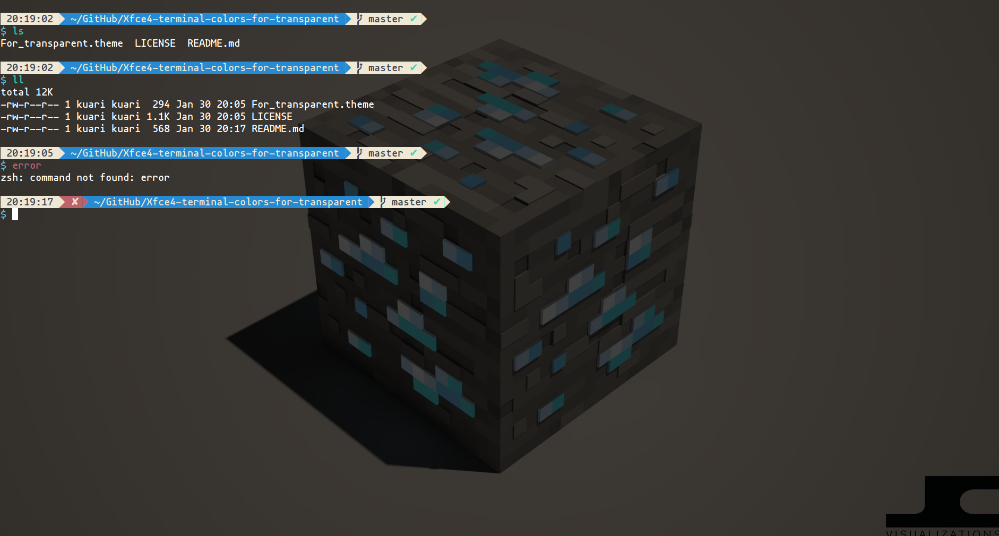

# For_transparent

### A theme for transparent xfce4-terminal.

## Screenshots


## Installation
````
```
git clone https://github.com/Kuari/Xfce4-terminal-colors-for-transparent.git

cp Xfce4-terminal-colors-for-transparent/For_transparent.theme /usr/share/xfce4/terminal/colorschemes
```

Then, select For_transparent in the xfce4-terminal setting.

## Other
When I tried a lot of excellent color schemes, but I didn't like them very much. I decided to write my own configuration, only for the transparent xfce4-terminal.

## Licence

MIT License. Copyright (c) 2019 kuari.
